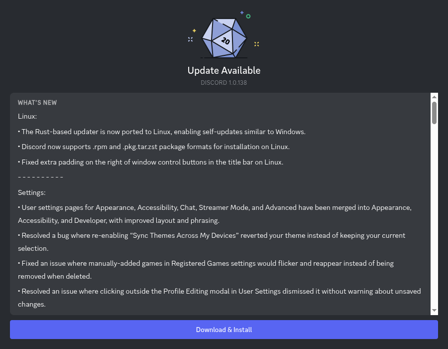

# Discord Shenanigans
## Linux Update Popup Tweaks

- Discord has frequent updates and if the app was downloaded from the .deb package on their official website, the update installation is manual unlike Windows, MAC OS. It's not an issue if it was downloaded using flatpak because that handles it automatically.

> Replaced the discord popup with a custom popup which displays the changelog of latest version summarized by AI and a download & install button automatically handles the installation and relaunches the app.

**Disclaimer: This tweak is currently only for Ubuntu and Debian. Can possibly break on future updates. Needs changes to discord app source code.**

- Decompiled discord's `app.asar` and made changes to the source code in app_bootstrap: 
  - Additions in **splashScreen.js**:
    1. `function httpsGet(url,options,callback)`: Follows redirects until the desired data is found. The download api url is targeted to a CDN hence the necessity of redirect.
    2. `function fetchText(url)`: Fetches raw HTML of the discord patch-notes page.
    3. `function stripHtml(html)`: Removes HTML elements not required.
    4. `function fetchDiscordChangelog()`: Finds the latest patch notes URL using the blog_hero div from the HTML returned by fetchText(). Fetches the HTML of that post, strips HTML and slices to get relevant content.
    5. `function fetchAISummary(changelog,ver)`: Loads summary from cache if present. Else makes API call to Gemini AI to get a summary of the changelog and saves it to cache.
    6. `function saveSummaryCache(ver,summary)`: Saves the generated summary of a version in a json file in /tmp. Acts as a cache.
    7. `function loadSummaryCache()`: Gets summary json stored in /tmp.
    8. Main process listens on a new channel `SPLASH_SCREEN_RELAUNCH` to relaunch the app after installing the update.
    9. Main process creates a child process to download the .deb package from the discord API and install it using OS command **pkexec**.
  - Modifications in **splashScreenPreload.js**:
    1. `function renderUpdateManually(state,override)`: HTML string to include the download & install button and summary in the popup.
    2. `function bindManualUpdateEvents()`: Specified DEB_URL and some UI design for install status.
  - Modified splash/index.css
  - Added .env to store Gemini API key.
  - Additional modules: @google/generative-ai, dotenv.

- Known Issues:
  - Fixing the relaunch logic as the dpkg kills the app before electron event does.
- Plans:
  - Concise changelog for all pending versions.
  - Better installation handling on UI.